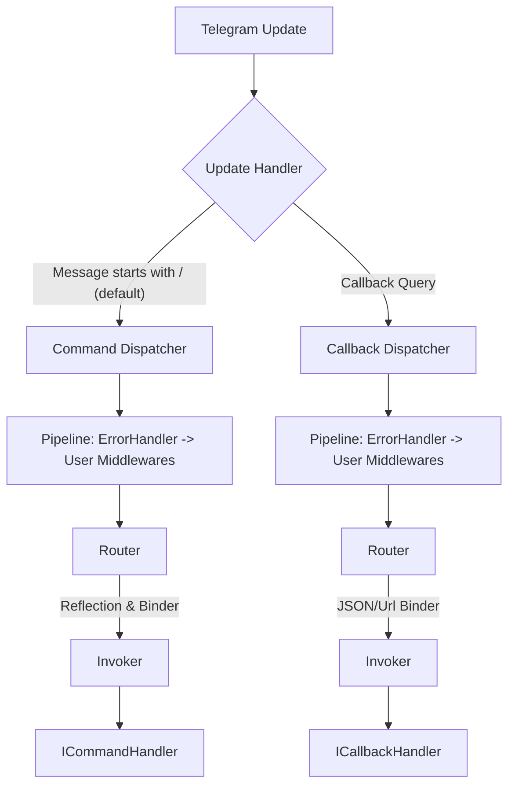

# Telegram.BotKit 🤖

**A structured, extensible .NET Framework for building Telegram bots.**

Built on top of the popular [Telegram.Bot](https://github.com/TelegramBots/Telegram.Bot) library, adopting **ASP.NET Core** principles: strong typing, Dependency Injection, and a Middleware Pipeline.

## 💡 Motivation
This project was born out of a desire to eliminate boilerplate code. Starting a new bot often meant copying the same logic over and over: string parsing, command switch-cases, and webhook configuration.

**Telegram.BotKit** handles this "grunt work," providing a convenient pipeline, DI, and strongly-typed parameters, allowing you to focus purely on business logic.

## 🏗 Architecture

The framework follows a **Handler-based** approach. Message processing flows through a configurable pipeline:

## ✨ Features
*   **Smart Binding:** Automatically maps text like `/duel rps 5` into a typed object `class { Game="rps", Wins=5 }`. Supports quotes (`key="val"`) and named arguments.
*   **Hybrid Hosting:** Supports both **Long Polling** (Console) and **Webhooks** (ASP.NET Core) out of the box — switch modes with a single line in the config.
*   **Middleware:** Global error handling, logging, and custom logic layers.
*   **Clear Structure:** Clean separation of logic for Commands and Inline Callbacks.

## 📦 Installation & Example

A complete usage example with source code can be found in the [📂 Telegram.BotKit.Example](Telegram.BotKit.Example) directory.